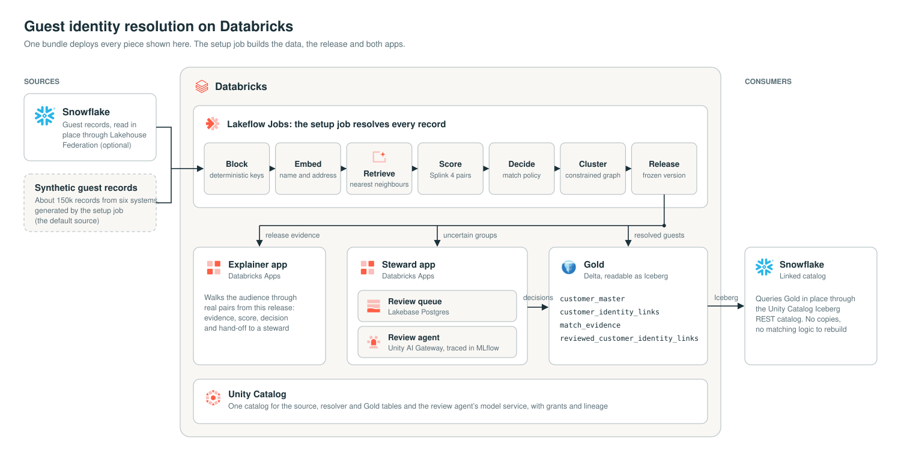

# Guest identity resolution on Databricks

Resolve guest records from many booking, ticketing, ordering and payment systems into one
profile per real guest. Hand the uncertain cases to a data steward, and publish the
result as Gold tables that Snowflake reads in place.

Everything runs on synthetic data: about 150,000 records for 61,000 made-up guests across
six source systems, with realistic typos, nicknames, shared household and work contacts,
and placeholder birth dates.



## Deploy

You need the [Databricks CLI](https://docs.databricks.com/dev-tools/cli/install.html)
(v1.17 or later), logged in to your workspace, and a Unity Catalog catalog you can create
schemas in. From a clone of this repo, run:

```bash
databricks bundle deploy --var catalog=<your_catalog> && databricks bundle run setup
```

- **`bundle deploy`** takes a few minutes. It creates the schemas, AI Search endpoint, SQL
  warehouse, Lakebase project, model service, experiment and setup job, then deploys and
  starts both apps.
- **`bundle run setup`** builds everything else in about three hours. Most of that is the
  embeddings and AI Search stages. It prints a link to the job run so you can follow it.

When it finishes, open the apps from **Compute > Apps**, or list them with
`databricks bundle summary`.

Add `-p <profile>` to both commands to use a CLI profile other than `DEFAULT`. If you
deploy again, pass the same `--var catalog`, or set it as the default in `databricks.yml`.

### Workspace requirements

- Unity Catalog, serverless jobs and serverless SQL warehouses
- AI Search (Vector Search), Lakebase and Databricks Apps
- Unity AI Gateway with the `system.ai` models `databricks-gpt-5-6-sol`,
  `databricks-gpt-5-5`, `databricks-claude-sonnet-5` and
  `databricks-qwen3-embedding-0-6b`

Use a dedicated catalog if you can. The bundle creates schemas with plain names (`source`,
`truth`, `reference`, `resolution_splink_v4`, `gold`, `steward_ai`), so they must not
already exist in the catalog.

## What the setup job does

| Task | What happens |
|---|---|
| `generate`, `validate_data` | Generates the synthetic guest records and their hidden ground truth, then fails the run if name, locality, email or contact statistics leave realistic bands |
| `source`, `profile`, `deterministic` | Snapshots and normalises the source, profiles contact points, and pairs records that share a strong key |
| `embeddings`, `ann` | Embeds each record's name and address separately (Qwen3, 512-d) and retrieves the 20 nearest neighbours of each from AI Search |
| `train`, `score` | Trains a Splink 4 model (tracked in MLflow) and scores every candidate pair field by field |
| `cluster`, `release` | Applies the versioned match policy, forms guests with a constrained graph (no two valid birth dates in one guest, no cannot-link pairs, bounded size) and freezes a versioned release |
| `publish_gold` | Publishes `gold.customer_master`, `gold.customer_identity_links` and `gold.match_evidence` from the pinned release, with Iceberg reads enabled |
| `load_steward` | Loads the release's uncertain groups into the Steward app's Lakebase review queue |
| `refresh_explainer` | Extracts this release's evidence into the explainer app and redeploys it |

Rerun the job to rebuild from scratch. The Steward queue then switches to the new release.

## The two apps

**Explainer (`identity-presenter`).** A presenter-driven walkthrough for a mixed
audience. It shows real pairs from your release being encoded, retrieved, compared,
scored and decided, then how pairs become guests and which ones go to a steward.

**Steward (`identity-steward`).** The operational queue. A steward reads one case's
records and evidence and decides whether they are one guest or several. A review agent
served through Unity AI Gateway can propose the decision, and the steward confirms it.
GPT-5.6 Sol is the primary model, falling back to GPT-5.5, then Claude Sonnet 5. See
[apps/steward/README.md](apps/steward/README.md) for the operator scripts, including
publishing decisions to Gold and resetting the queue between demos.

Neither app reads the synthetic ground truth in the `truth` schema, and neither does the
resolver. The only reader is the explainer's extraction task, and it reads just the
curated-scenario table, to find which pairs to show.

## Snowflake

**Read Gold from Snowflake.** Gold is managed Delta with Iceberg reads enabled, so
Snowflake queries it in place through the Unity Catalog Iceberg REST catalog:

1. Create a service principal with an OAuth secret, and run
   [`snowflake/gold_reader_grants.sql`](snowflake/gold_reader_grants.sql) in Databricks
   to let it read only `gold`.
2. Fill in and run
   [`snowflake/linked_catalog.sql.template`](snowflake/linked_catalog.sql.template) in
   Snowflake. It creates a catalog integration and a linked database, `DATABRICKS_GOLD`.

**Resolve records that live in Snowflake.** Create a Snowflake connection and a foreign
catalog with [Lakehouse Federation](https://docs.databricks.com/query-federation/snowflake.html),
then point the resolver at your table:

```bash
databricks bundle deploy --var catalog=<your_catalog> \
  --var source_table=<foreign_catalog>.<schema>.<table> && databricks bundle run setup
```

The table needs the columns the resolver reads (`resolution/splink_v4/source.py`,
`SOURCE_COLUMNS`). The generator still runs and fills the demo's own `source` schema.

## Tear down

```bash
databricks bundle destroy --var catalog=<your_catalog>
```

This removes the apps, job, warehouse, AI Search endpoint, Lakebase project, model
service and schemas, including their data. It leaves the catalog and the MLflow training
experiment (`/Users/<you>/identity-splink-v4-model-training`).

## Repository layout

| Path | Contents |
|---|---|
| `databricks.yml`, `resources/` | The bundle: platform resources, apps and the setup job |
| `synthetic-data/` | The generator: SQL, public reference data and realism checks |
| `resolution/splink_v4/` | The resolver pipeline, one module per stage |
| `tasks/` | Setup job tasks that publish Gold, load the Steward queue and refresh the explainer |
| `apps/steward/` | Steward app: FastAPI, Lakebase, review agent |
| `apps/identity-presenter/` | Explainer app |
| `snowflake/` | Templates for reading Gold from Snowflake |
| `docs/architecture.svg` | The diagram above |
